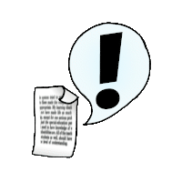

# ChangeScan



**Release 3.1** - A program that can tell you what has changed on a computer's
file system. It is the spiritual successor of a JavaScript program I created many years ago for
a client to test their installer. Scan all or part of the filesystem; perform
your installation (or otherwise cause changes); scan it again and it tells you
what changed.

  - For normal usage: `java -jar ChangeScan.jar`
  - For more examples: `java -jar ChangeScan.jar examples`
  - For license information: `java -jar ChangeScan.jar license`
  - Latest release is available to the right under **[Releases](https://github.com/william-hood/ChangeScan/releases)**.
<br>

---

```
$ java -jar ChangeScan.jar
Change Scan - © 2020, 2023, 2025 William Arthur Hood
📜  MIT Licensed: java -jar ChangeScan.jar LICENSE
‼️👉    Examples: java -jar ChangeScan.jar EXAMPLES
Change Scan is a tool for seeing what changed on a file system as the
result of a software install, uninstall, or any other process that
might cause files to be created, changed, or deleted. YOU MAY NEED TO
RUN THIS PROGRAM WITH ADMINISTRAIVE PRIVILEDGES.

1. Create a baseline...
   java -jar ChangeScan.jar ROOT <root folder> SAVE <baseline filename>

2. Install, Uninstall, or otherwise cause changes...

3. Scan again, comparing against the baseline...
   java -jar ChangeScan.jar ROOT <root folder> COMPARE <baseline filename> REPORT <report filename>

* Instead of ROOT and SAVE, the switch USE provides a comparison
  between two already existing baselines.
* Report is HTML format.
* Exclude items using EXCLUDE <DIRECTORY|FILE|PATTERN> <excluded item>
* Save the console output with LOG <output filename>
```
---

```
$ java -jar ChangeScan.jar EXAMPLES
Create baseline or scan a 2nd time (use a different filename)
java -jar ChangeScan.jar ROOT <root folder> SAVE <baseline filename>

As above, but exclude directory
java -jar ChangeScan.jar ROOT <root> SAVE <filename> EXCLUDE DIRECTORY <fully qualified folder name>

As above, but exclude file
java -jar ChangeScan.jar ROOT <root> SAVE <filename> EXCLUDE FILE <fully qualified filename>

As above, but exclude everything with a substring
java -jar ChangeScan.jar ROOT <root> SAVE <filename> EXCLUDE PATTERN <substring>

As above, but with multiple exclusions (no limit)
java -jar ChangeScan.jar ROOT <root> SAVE <filename> EXCLUDE PATTERN <string> EXCLUDE FILE <filename> EXCLUDE DIRECTORY <name>

Scan and compare against the baseline (won't save this scan; you may add EXCLUDE as above)
java -jar ChangeScan.jar ROOT <root folder> COMPARE <baseline filename> REPORT <report filename>

DO NOT scan, just compare two baseline files
java -jar ChangeScan.jar USE <post change baseline>.fsc COMPARE <pre change baseline>.fsc

Note that 'EXCLUDE' is the only argument that may appear multiple times.
```

---

**WINDOWS USERS MAY NEED TO FOLLOW THESE STEPS TO PROPERLY DISPLAY EMOJIS IN THE CONSOLE**

https://akr.am/blog/posts/using-utf-8-in-the-windows-terminal

---

## Released under the terms of the MIT License
© 2020, 2023, 2025 William Hood

*Permission is hereby granted, free of charge, to any person obtaining a copy
of this software and associated documentation files (the "Software"), to deal
in the Software without restriction, including without limitation the rights to
use, copy, modify, merge, publish, distribute, sublicense, and/or sell copies
of the Software, and to permit persons to whom the Software is furnished
to do so, subject to the following conditions:*

*The above copyright notice and this permission notice shall be included
in all copies or substantial portions of the Software.*

*THE SOFTWARE IS PROVIDED "AS IS", WITHOUT WARRANTY OF ANY KIND,
EXPRESS OR IMPLIED, INCLUDING BUT NOT LIMITED TO THE WARRANTIES
OF MERCHANTABILITY, FITNESS FOR A PARTICULAR PURPOSE AND
NONINFRINGEMENT. IN NO EVENT SHALL THE AUTHORS OR COPYRIGHT
HOLDERS BE LIABLE FOR ANY CLAIM, DAMAGES OR OTHER LIABILITY,
WHETHER IN AN ACTION OF CONTRACT, TORT OR OTHERWISE, ARISING
FROM, OUT OF OR IN CONNECTION WITH THE SOFTWARE OR THE USE OR
OTHER DEALINGS IN THE SOFTWARE.*


## Contact Information
https://www.linkedin.com/in/william-a-hood-pdx/

william.arthur.hood@gmail.com
